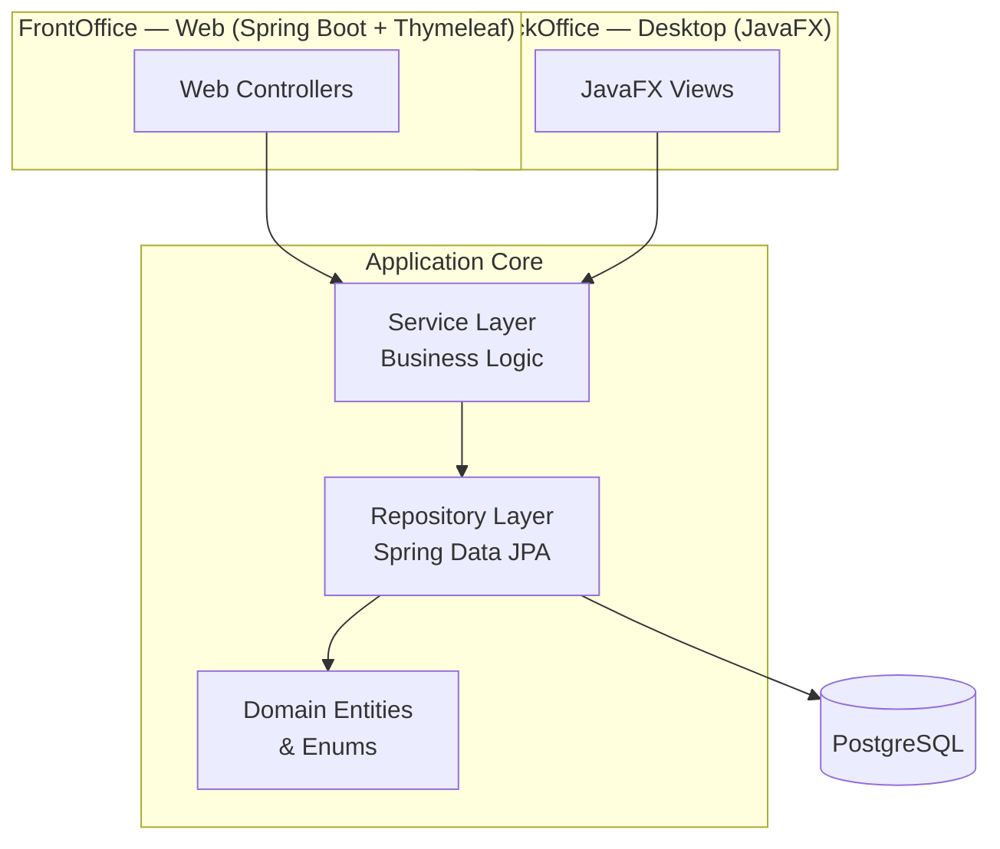
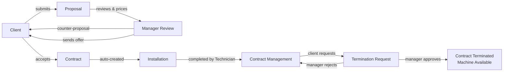
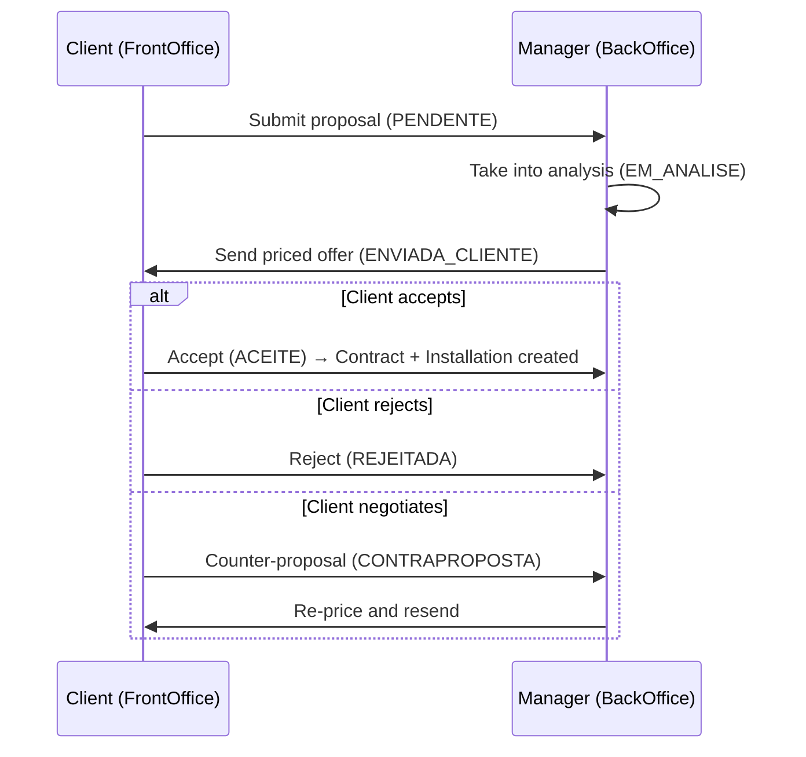

# Vending Rental Management System

> Academic project (**Projeto II**) — a full-stack application that manages the complete lifecycle of vending machine rentals, from the initial commercial proposal through contract management, installation, and termination.

The system is composed of two complementary applications that share the same domain model and PostgreSQL database:

- **BackOffice** — a **JavaFX** desktop application used by internal staff (Administrator, Manager, Receptionist, Technician).
- **FrontOffice** — a **Spring Boot + Thymeleaf** web application used by clients to manage their own proposals, contracts, and installations.

---

## Table of Contents

1. [Overview](#overview)
2. [Features](#features)
3. [Architecture](#architecture)
4. [Role Permissions Matrix](#role-permissions-matrix)
5. [Business Workflow](#business-workflow)
6. [Domain Model](#domain-model)
7. [Domain States](#domain-states)
8. [Installation](#installation)
9. [PostgreSQL Setup](#postgresql-setup)
10. [Building with Maven](#building-with-maven)
11. [Running the Web Application (FrontOffice)](#running-the-web-application-frontoffice)
12. [Running the Desktop Application (BackOffice)](#running-the-desktop-application-backoffice)
13. [Example Credentials](#example-credentials)
14. [Project Structure](#project-structure)
15. [Technologies](#technologies)
16. [Future Improvements](#future-improvements)
17. [Authors](#authors)

---

## Overview

The **Vending Rental Management System** digitalises the rental business of a company that leases vending machines to clients such as schools, gyms, and offices.

The application separates concerns between an internal **BackOffice** and a client-facing **FrontOffice**:

- Clients submit rental **proposals** through the web portal and negotiate commercial terms.
- Managers review proposals, define pricing, and send commercial offers back to the client.
- When a proposal is accepted, a **contract** and an **installation** are created automatically.
- Technicians complete or postpone scheduled installations.
- Clients can request the **early termination** of an active contract, which a manager approves or rejects.

The project demonstrates a clean **3-layer architecture** (Controller / Service / Repository), role-based access in the desktop client, and a session-based client portal — all backed by JPA/Hibernate persistence on PostgreSQL.

---

## Features

### BackOffice (JavaFX Desktop)
- Role selection screen with four distinct roles and colour-coded themes.
- Full client management (CRUD) with portal credential assignment.
- Vending machine management.
- Proposal negotiation: analysis, pricing, counter-proposals, and dispatch to client.
- Contract management.
- Installation scheduling and lifecycle management.
- Contract termination request review (approve / reject).
- Read-only screens for restricted roles.

### FrontOffice (Web Portal)
- Client login with session management.
- Personalised dashboard with summary cards and recent activity.
- View and edit personal contact information (email, telephone, address, password).
- Submit new vending machine proposals.
- Select desired contract duration (**1, 2, or 3 years**).
- Accept, reject, or counter-propose commercial offers.
- View contracts and installations.
- Request early contract termination with a justified reason.

---

## Architecture

The application follows the classic **Controller → Service → Repository** layered pattern, with a shared JPA domain model persisted to PostgreSQL.



| Layer | Responsibility |
|-------|----------------|
| **Controller / View** | Handle HTTP requests (web) or UI events (JavaFX). No business rules. |
| **Service** | Enforce business logic, transactions, validation, and state transitions. |
| **Repository** | Spring Data JPA interfaces for data access. |
| **Domain** | JPA entities and enums representing the business model. |

---

## Role Permissions Matrix

Permission enforcement is split across two layers:

1. **Navigation layer** (`DesktopMainView`) — the primary gate. Each role receives a fixed set of menu items at login; unreachable screens are never instantiated.
2. **View layer** — a secondary, partial gate. `ClienteDesktopView` checks the role explicitly at runtime. `ContratoDesktopView` and `PropostaDesktopView` receive a `readOnly` boolean from the caller. All other views perform no internal role checks and trust the navigation gate entirely.

Each role has a distinct colour scheme applied throughout the desktop UI:

| Role | Theme Colour |
|------|-------------|
| Administrador | Blue (`#2980b9`) |
| Gestor | Green (`#27ae60`) |
| Rececionista | Purple (`#8e44ad`) |
| Técnico | Orange (`#d35400`) |

### ADMIN (Administrador)

The only role with access to all non-TECNICO screens. When creating users, the role picker is restricted to `GESTOR`, `RECECIONISTA`, and `TECNICO` — a second ADMIN **cannot** be created through the UI.

**Visible menu items:** Gerir Clientes, Gerir Vending Machines, Gerir Propostas, Gerir Contratos, Gerir Instalações, Pedidos Rescisão, Pedidos de Conta, Audit Logs, Utilizadores.

| Screen | View | Create | Edit | Delete | Approve / Reject | Complete / Postpone | Reset Password |
|--------|:----:|:------:|:----:|:------:|:----------------:|:-------------------:|:--------------:|
| Clientes | ✅ | ✅ | ✅ | ✅ | — | — | — |
| Vending Machines | ✅ | ✅ | ✅ | ✅ | — | — | — |
| Propostas | ✅ | — | ✅ | — | — | — | — |
| Contratos | ✅ | ✅ | ✅ | ✅ | — | — | — |
| Instalações | ✅ | ✅ | ✅ | ✅ | — | — | — |
| Pedidos Rescisão | ✅ | — | — | — | ✅ | — | — |
| Pedidos de Conta | ✅ | — | — | — | ✅ | — | — |
| Audit Logs | ✅ | — | — | — | — | — | — |
| Utilizadores | ✅ | ✅ | ✅ | — | — | — | ✅ |

### GESTOR (Gestor)

Shares the same full-CRUD views as ADMIN for Proposals, Contracts, Installations, and Termination Requests. No access to Clients, Vending Machines, Audit Logs, or User Management.

**Visible menu items:** Gerir Propostas, Gerir Contratos, Gerir Instalações, Pedidos Rescisão, Pedidos de Conta.

| Screen | View | Create | Edit | Delete | Approve / Reject | Complete / Postpone | Reset Password |
|--------|:----:|:------:|:----:|:------:|:----------------:|:-------------------:|:--------------:|
| Propostas | ✅ | — | ✅ | — | — | — | — |
| Contratos | ✅ | ✅ | ✅ | ✅ | — | — | — |
| Instalações | ✅ | ✅ | ✅ | ✅ | — | — | — |
| Pedidos Rescisão | ✅ | — | — | — | ✅ | — | — |
| Pedidos de Conta | ✅ | — | — | — | ✅ | — | — |

### RECECIONISTA (Rececionista)

Can create and edit clients but the Delete button is rendered disabled (50% opacity + tooltip). Contracts and Proposals open in **read-only mode** — a lock icon is shown in the heading and only a Refresh button is rendered; all action buttons are never instantiated.

**Visible menu items:** Gerir Clientes, Ver Contratos (read-only), Ver Propostas (read-only), Pedidos de Conta.

| Screen | View | Create | Edit | Delete | Approve / Reject | Complete / Postpone | Reset Password |
|--------|:----:|:------:|:----:|:------:|:----------------:|:-------------------:|:--------------:|
| Clientes | ✅ | ✅ | ✅ | ❌ ¹ | — | — | — |
| Contratos | 🔒 | — | — | — | — | — | — |
| Propostas | 🔒 | — | — | — | — | — | — |
| Pedidos de Conta | ✅ | — | — | — | ✅ | — | — |

> ¹ Delete is rendered but disabled with tooltip: *"Rececionista não tem permissão para eliminar clientes."*
> 🔒 Read-only mode — heading shows a lock icon; only Refresh is available.

### TECNICO (Técnico)

Completely isolated from all commercial and administrative roles. The only role that auto-redirects to its screen on login with no home/welcome screen. Uses `TecnicoInstalacaoView` — a separate class from the management view — exposing only Complete and Postpone actions.

**Visible menu items:** Instalações (Técnico).

| Screen | View | Create | Edit | Delete | Approve / Reject | Complete / Postpone | Reset Password |
|--------|:----:|:------:|:----:|:------:|:----------------:|:-------------------:|:--------------:|
| Instalações (técnico) | ✅ | — | — | — | — | ✅ ² | — |

> ² Buttons are enabled/disabled based on installation state (`AGENDADA`), not the role itself.

### Full Permissions Matrix

| Feature / Action | ADMIN | GESTOR | RECECIONISTA | TECNICO |
|---|:---:|:---:|:---:|:---:|
| Clientes — Ver | ✅ | ❌ | ✅ | ❌ |
| Clientes — Criar | ✅ | ❌ | ✅ | ❌ |
| Clientes — Editar | ✅ | ❌ | ✅ | ❌ |
| Clientes — Eliminar | ✅ | ❌ | ❌ | ❌ |
| Vending Machines — Ver | ✅ | ❌ | ❌ | ❌ |
| Vending Machines — Criar | ✅ | ❌ | ❌ | ❌ |
| Vending Machines — Editar | ✅ | ❌ | ❌ | ❌ |
| Vending Machines — Eliminar | ✅ | ❌ | ❌ | ❌ |
| Propostas — Ver | ✅ | ✅ | 🔒 | ❌ |
| Propostas — Analisar / Enviar | ✅ | ✅ | ❌ | ❌ |
| Contratos — Ver | ✅ | ✅ | 🔒 | ❌ |
| Contratos — Criar | ✅ | ✅ | ❌ | ❌ |
| Contratos — Editar | ✅ | ✅ | ❌ | ❌ |
| Contratos — Eliminar | ✅ | ✅ | ❌ | ❌ |
| Instalações (gestão) — Ver | ✅ | ✅ | ❌ | ❌ |
| Instalações (gestão) — Criar | ✅ | ✅ | ❌ | ❌ |
| Instalações (gestão) — Editar | ✅ | ✅ | ❌ | ❌ |
| Instalações (gestão) — Eliminar | ✅ | ✅ | ❌ | ❌ |
| Instalações (técnico) — Ver | ❌ | ❌ | ❌ | ✅ |
| Instalações (técnico) — Concluir | ❌ | ❌ | ❌ | ✅ |
| Instalações (técnico) — Adiar | ❌ | ❌ | ❌ | ✅ |
| Pedidos Rescisão — Ver | ✅ | ✅ | ❌ | ❌ |
| Pedidos Rescisão — Aprovar / Rejeitar | ✅ | ✅ | ❌ | ❌ |
| Pedidos de Conta — Ver | ✅ | ✅ | ✅ | ❌ |
| Pedidos de Conta — Aprovar / Rejeitar | ✅ | ✅ | ✅ | ❌ |
| Audit Logs — Ver | ✅ | ❌ | ❌ | ❌ |
| Utilizadores — Ver | ✅ | ❌ | ❌ | ❌ |
| Utilizadores — Criar | ✅ | ❌ | ❌ | ❌ |
| Utilizadores — Ativar / Desativar | ✅ | ❌ | ❌ | ❌ |
| Utilizadores — Repor Password | ✅ | ❌ | ❌ | ❌ |

**Legend:** ✅ Full access · 🔒 Read-only · ❌ No access

### Role Relationships

- **ADMIN** is a superset of GESTOR, and additionally has Clientes, Vending Machines, Audit Logs, and Utilizadores.
- **GESTOR** and **RECECIONISTA** are not hierarchically related. Their only shared screen is Pedidos de Conta.
- **TECNICO** is fully isolated — no shared screens with any other role.

---

## Business Workflow



### Proposal Negotiation Detail



---

## Domain Model

All entities use `@GeneratedValue(strategy = GenerationType.IDENTITY)` for their primary key and `@Enumerated(EnumType.STRING)` for all enum fields. No cascade settings are defined on any relationship — all lifecycle management is handled explicitly in the service layer.

---

### Entity: Cliente

**Table:** `clientes`

| Field | Type | Constraint |
|-------|------|-----------|
| `id` | `Long` | PK, auto-increment |
| `nome` | `String` | NOT NULL |
| `email` | `String` | NOT NULL, UNIQUE |
| `telefone` | `String` | nullable |
| `morada` | `String` | nullable |
| `nif` | `String` | NOT NULL, UNIQUE |
| `estado` | `EstadoCliente` | NOT NULL, default `ATIVO` |
| `dataRegisto` | `LocalDate` | NOT NULL, default today |
| `username` | `String` | UNIQUE, nullable |
| `password` | `String` | nullable |

**Enums:** `EstadoCliente` — `ATIVO`, `INATIVO`, `SUSPENSO`

**Relationships:** none (referenced by `Proposta`, `Contrato`, `PasswordResetToken`)

---

### Entity: VendingMachine

**Table:** `vending_machines`

| Field | Type | Constraint |
|-------|------|-----------|
| `id` | `Long` | PK, auto-increment |
| `codigo` | `String` | NOT NULL, UNIQUE |
| `modelo` | `String` | NOT NULL |
| `localizacao` | `String` | nullable |
| `estado` | `EstadoVendingMachine` | NOT NULL, default `DISPONIVEL` |
| `precoAluguerMensal` | `BigDecimal` | NOT NULL |

**Enums:** `EstadoVendingMachine` — `DISPONIVEL`, `ALUGADA`, `MANUTENCAO`, `FORA_SERVICO`

**Relationships:** none (referenced by `Proposta`, `Contrato`)

---

### Entity: Proposta

**Table:** `propostas`

| Field | Type | Constraint |
|-------|------|-----------|
| `id` | `Long` | PK, auto-increment |
| `cliente` | `Cliente` | FK `cliente_id`, NOT NULL |
| `vendingMachine` | `VendingMachine` | FK `vending_machine_id`, NOT NULL |
| `dataProposta` | `LocalDate` | NOT NULL, default today |
| `valorProposto` | `BigDecimal` | NOT NULL |
| `estado` | `EstadoProposta` | NOT NULL, default `PENDENTE` |
| `observacoes` | `String` | nullable |
| `valorGestor` | `BigDecimal` | nullable |
| `observacoesGestor` | `String` | nullable |
| `duracaoAnos` | `Integer` | nullable |

**Enums:** `EstadoProposta` — `PENDENTE`, `EM_ANALISE`, `ENVIADA_CLIENTE`, `ACEITE`, `REJEITADA`, `CONTRAPROPOSTA`, `EXPIRADA`

**Relationships:**
- `@ManyToOne(fetch = LAZY)` → `Cliente` via `cliente_id` — many proposals per client
- `@ManyToOne(fetch = LAZY)` → `VendingMachine` via `vending_machine_id` — many proposals per machine

---

### Entity: Contrato

**Table:** `contratos`

| Field | Type | Constraint |
|-------|------|-----------|
| `id` | `Long` | PK, auto-increment |
| `cliente` | `Cliente` | FK `cliente_id`, NOT NULL |
| `vendingMachine` | `VendingMachine` | FK `vending_machine_id`, NOT NULL |
| `dataInicio` | `LocalDate` | NOT NULL |
| `dataFim` | `LocalDate` | nullable |
| `valorMensal` | `BigDecimal` | NOT NULL |
| `estado` | `EstadoContrato` | NOT NULL, default `RASCUNHO` |

**Enums:** `EstadoContrato` — `RASCUNHO`, `ATIVO`, `SUSPENSO`, `TERMINADO`

**Relationships:**
- `@ManyToOne(fetch = LAZY)` → `Cliente` via `cliente_id` — many contracts per client
- `@ManyToOne(fetch = LAZY)` → `VendingMachine` via `vending_machine_id` — many contracts per machine

---

### Entity: Instalacao

**Table:** `instalacoes`

| Field | Type | Constraint |
|-------|------|-----------|
| `id` | `Long` | PK, auto-increment |
| `contrato` | `Contrato` | FK `contrato_id`, NOT NULL |
| `dataInstalacao` | `LocalDate` | NOT NULL |
| `localInstalacao` | `String` | NOT NULL |
| `estado` | `EstadoInstalacao` | NOT NULL, default `AGENDADA` |
| `observacoes` | `String` | nullable |
| `dataConclusao` | `LocalDate` | nullable, set on completion |
| `motivoAdiamento` | `MotivoAdiamento` | nullable, set on postponement |
| `novaDataAgendada` | `LocalDate` | nullable, set on postponement |

**Enums:**
- `EstadoInstalacao` — `AGENDADA`, `EM_CURSO`, `CONCLUIDA`, `CANCELADA`, `ADIADA`
- `MotivoAdiamento` — `CLIENTE_AUSENTE`, `PROBLEMA_TECNICO`, `ACESSO_INDISPONIVEL`, `MAQUINA_NAO_ENTREGUE`, `OUTRO`

**Relationships:**
- `@ManyToOne(fetch = LAZY)` → `Contrato` via `contrato_id` — many installations per contract

---

### Entity: PedidoRescisaoContrato

**Table:** `pedidos_rescisao`

| Field | Type | Constraint |
|-------|------|-----------|
| `id` | `Long` | PK, auto-increment |
| `contrato` | `Contrato` | FK `contrato_id`, NOT NULL |
| `motivo` | `MotivoRescisao` | NOT NULL |
| `descricao` | `String` | nullable |
| `dataPedido` | `LocalDate` | NOT NULL, default today |
| `estado` | `EstadoPedidoRescisao` | NOT NULL, default `PENDENTE` |

**Enums:**
- `MotivoRescisao` — `INSATISFACAO_SERVICO`, `PRECO_ELEVADO`, `JA_NAO_NECESSITA`, `PROBLEMAS_TECNICOS`, `OUTRO`
- `EstadoPedidoRescisao` — `PENDENTE`, `APROVADO`, `REJEITADO`

**Relationships:**
- `@ManyToOne(fetch = LAZY)` → `Contrato` via `contrato_id` — many termination requests per contract

---

### Entity: AccountRequest

**Table:** `account_requests`

| Field | Type | Constraint |
|-------|------|-----------|
| `id` | `Long` | PK, auto-increment |
| `nome` | `String` | NOT NULL |
| `nif` | `String` | NOT NULL |
| `email` | `String` | NOT NULL |
| `telefone` | `String` | nullable |
| `morada` | `String` | nullable |
| `usernameRequested` | `String` | NOT NULL, UNIQUE |
| `passwordHash` | `String` | NOT NULL |
| `estado` | `EstadoAccountRequest` | NOT NULL, default `PENDENTE` |
| `dataPedido` | `LocalDate` | NOT NULL, default today |
| `observacoes` | `String` | nullable |

**Enums:** `EstadoAccountRequest` — `PENDENTE`, `APROVADO`, `REJEITADO`

**Relationships:** none (standalone — approved requests create a `Cliente`)

---

### Entity: BackOfficeUser

**Table:** `backoffice_users`

| Field | Type | Constraint |
|-------|------|-----------|
| `id` | `Long` | PK, auto-increment |
| `username` | `String` | NOT NULL, UNIQUE |
| `passwordHash` | `String` | NOT NULL |
| `role` | `BackOfficeRole` | NOT NULL |
| `active` | `boolean` | NOT NULL, default `true` |
| `createdAt` | `LocalDateTime` | NOT NULL, default now |

**Enums:** `BackOfficeRole` — `ADMIN`, `GESTOR`, `RECECIONISTA`, `TECNICO`

**Relationships:** none

---

### Entity: PasswordResetToken

**Table:** `password_reset_tokens`

| Field | Type | Constraint |
|-------|------|-----------|
| `id` | `Long` | PK, auto-increment |
| `token` | `String` | NOT NULL, UNIQUE |
| `cliente` | `Cliente` | FK `cliente_id`, NOT NULL |
| `expiresAt` | `LocalDateTime` | NOT NULL |
| `used` | `boolean` | NOT NULL, default `false` |
| `createdAt` | `LocalDateTime` | NOT NULL, default now |

**Enums:** none

**Relationships:**
- `@ManyToOne(fetch = LAZY)` → `Cliente` via `cliente_id` — many tokens per client

---

### Entity: AuditLog

**Table:** `audit_logs`

| Field | Type | Constraint |
|-------|------|-----------|
| `id` | `Long` | PK, auto-increment |
| `timestamp` | `LocalDateTime` | NOT NULL, default now |
| `actorRole` | `String` | NOT NULL |
| `actorName` | `String` | NOT NULL |
| `action` | `AuditAction` | NOT NULL |
| `entityName` | `String` | nullable |
| `entityId` | `Long` | nullable |
| `description` | `String` | max 500 chars, nullable |
| `oldValue` | `TEXT` | nullable |
| `newValue` | `TEXT` | nullable |

**Enums:** `AuditAction` — `CREATE`, `UPDATE`, `DELETE`, `STATUS_CHANGE`, `LOGIN`, `LOGIN_FAILED`, `LOGOUT`, `ACCEPT`, `REJECT`, `COUNTER_PROPOSAL`, `TERMINATION_REQUEST`, `INSTALLATION_COMPLETED`, `INSTALLATION_DELAYED`, `ACCOUNT_REQUEST_SUBMITTED`, `ACCOUNT_REQUEST_APPROVED`, `ACCOUNT_REQUEST_REJECTED`, `PASSWORD_RESET_REQUESTED`, `PASSWORD_RESET_COMPLETED`, `PASSWORD_RESET_FAILED`

**Relationships:** none — references other entities via `entityName` (String) + `entityId` (Long) to avoid hard FK coupling.

---

### Entity Relationship Overview

```
Cliente ──────────────────── Proposta ──── VendingMachine
   │         (ManyToOne)        │              │
   │                            │ (ManyToOne)  │
   │         (ManyToOne)        ▼              │
   ├──────────────────────── Contrato ─────────┘
   │                            │
   │                            ├─── (ManyToOne) ── Instalacao
   │                            │
   │                            └─── (ManyToOne) ── PedidoRescisaoContrato
   │
   └─── (ManyToOne) ── PasswordResetToken

AccountRequest   (standalone — approved → creates Cliente)
BackOfficeUser   (standalone — internal staff)
AuditLog         (standalone — soft ref via entityName + entityId)
```

---

## Domain States

### Proposal States
| State | Meaning |
|-------|---------|
| `PENDENTE` | Submitted by client, awaiting manager. |
| `EM_ANALISE` | Under analysis by manager. |
| `ENVIADA_CLIENTE` | Priced offer sent to client. |
| `ACEITE` | Accepted — contract created automatically. |
| `REJEITADA` | Rejected by client. |
| `CONTRAPROPOSTA` | Client returned a counter-proposal. |

### Installation States
| State | Meaning |
|-------|---------|
| `AGENDADA` | Scheduled, pending execution. |
| `CONCLUIDA` | Completed (completion date set automatically). |
| `ADIADA` | Postponed (requires a new date and a delay reason). |

### Termination Request States
| State | Meaning |
|-------|---------|
| `PENDENTE` | Submitted by client, awaiting manager. |
| `APROVADO` | Approved — contract terminated, machine freed. |
| `REJEITADO` | Rejected — contract remains active. |

---

## Installation

### Prerequisites
- **Java 21** (JDK)
- **Maven 3.9+**
- **PostgreSQL 14+**
- A Git client

### Clone the repository
```bash
git clone https://github.com/frocha1012/vending-rental-management-system.git
cd vending-rental-management-system
```

---

## PostgreSQL Setup

1. Ensure PostgreSQL is running locally on port `5432`.
2. Create the database:

```sql
CREATE DATABASE vending_rental;
```

3. The default connection settings (in `src/main/resources/application.properties`) are:

| Property | Value |
|----------|-------|
| URL | `jdbc:postgresql://localhost:5432/vending_rental` |
| Username | `postgres` |
| Password | `pwd` |

Adjust these values to match your local PostgreSQL credentials if needed.

> The schema is created automatically on first run (`spring.jpa.hibernate.ddl-auto=update`), and seed data plus required `CHECK`-constraint migrations are applied at startup.

---

## Building with Maven

Compile and package the project:

```bash
mvn clean install
```

Run only the compilation step:

```bash
mvn compile
```

---

## Running the Web Application (FrontOffice)

Start the Spring Boot web application:

```bash
mvn spring-boot:run
```

Then open your browser at:

```
http://localhost:8080
```

You will be redirected to the client login page.

> 📸 _Screenshot placeholder: client portal dashboard_
>
> ``

---

## Running the Desktop Application (BackOffice)

The JavaFX BackOffice boots its own headless Spring context (sharing the same services and database) and launches the desktop UI:

```bash
mvn javafx:run
```

The main entry point is `pt.ipvc.vending.javafx.DesktopLauncher`.

On launch you are presented with the **role selection screen** (Administrator, Manager, Receptionist, Technician). No password is required for role selection — it determines which menus and screens are available.

> 📸 _Screenshot placeholder: role selection screen_
>
> ``

> 📸 _Screenshot placeholder: installation management (Technician)_
>
> ``

---

## Example Credentials

The application seeds demo data on first startup (only when the database is empty).

### Client Portal (Web FrontOffice)

| Client | Username | Password |
|--------|----------|----------|
| Escola Secundária de Viseu | `escola` | `1234` |
| Ginásio FitViseu | `ginasio` | `1234` |

### BackOffice (JavaFX Desktop)
No login is required — simply select a role on the opening screen:

| Role | Theme |
|------|-------|
| Administrador | Blue |
| Gestor | Green |
| Rececionista | Purple |
| Técnico | Orange |

---

## Project Structure

```
vending-rental-system/
├── pom.xml
├── README.md
└── src/main/
    ├── java/pt/ipvc/vending/
    │   ├── VendingRentalApplication.java      # Spring Boot entry point (web)
    │   │
    │   ├── config/                            # Startup components
    │   │   ├── DataSeeder.java                # Seeds demo data
    │   │   ├── DatabaseMigration.java         # Fixes enum CHECK constraints
    │   │   └── WebConfig.java                 # MVC + interceptor registration
    │   │
    │   ├── domain/
    │   │   ├── entity/                        # JPA entities
    │   │   │   ├── Cliente.java
    │   │   │   ├── VendingMachine.java
    │   │   │   ├── Contrato.java
    │   │   │   ├── Proposta.java
    │   │   │   ├── Instalacao.java
    │   │   │   └── PedidoRescisaoContrato.java
    │   │   └── enums/                         # Domain enums (states, reasons, roles)
    │   │
    │   ├── repository/                        # Spring Data JPA repositories
    │   ├── service/                           # Business logic layer
    │   │   └── exception/                     # Custom exceptions
    │   │
    │   ├── web/
    │   │   ├── controller/                    # Web controllers (portal + admin CRUD)
    │   │   └── interceptor/                   # PortalInterceptor (session auth)
    │   │
    │   └── javafx/                            # BackOffice desktop application
    │       ├── DesktopLauncher.java           # JavaFX + Spring bootstrap
    │       ├── DesktopApplication.java
    │       ├── DesktopMainView.java
    │       ├── RoleSelectionView.java
    │       ├── BackofficeRole.java / RoleTheme.java
    │       └── *DesktopView.java              # Per-module management views
    │
    └── resources/
        ├── application.properties
        └── templates/                         # Thymeleaf templates
            ├── portal/                        # Client FrontOffice pages
            ├── clientes/ · vending-machines/  # Admin CRUD pages
            ├── contratos/ · propostas/ · instalacoes/
            ├── layout.html · portal-layout.html
            └── login.html
```

---

## Technologies

| Category | Technology |
|----------|-----------|
| Language | Java 21 |
| Application Framework | Spring Boot 3 |
| Persistence | Spring Data JPA · Hibernate |
| Database | PostgreSQL |
| Web Templating | Thymeleaf |
| Frontend Styling | Bootstrap 5 |
| Desktop UI | JavaFX |
| Build Tool | Maven |
| Architecture | Controller / Service / Repository (3-layer) |

---

## Future Improvements

- 🔐 **Spring Security** integration for proper BackOffice authentication and password hashing.
- 📊 **Reporting & dashboards** with revenue, occupancy, and contract analytics.
- 📧 **Email notifications** for proposal status changes and installation scheduling.
- 🧾 **PDF generation** for contracts and invoices.
- 🌐 **Internationalisation (i18n)** for multi-language support.
- 🧪 **Automated test suite** (unit + integration) with CI pipeline.
- 📱 **Responsive / mobile-first** redesign of the client portal.
- 🔁 **Audit log** tracking all state transitions for traceability.

---

## Authors

| Name | Role |
|------|------|
| _frocha1012_ | Developer |

> Developed as part of **Projeto II** — Instituto Politécnico de Viana do Castelo (IPVC).

---

_This project is for academic purposes._
