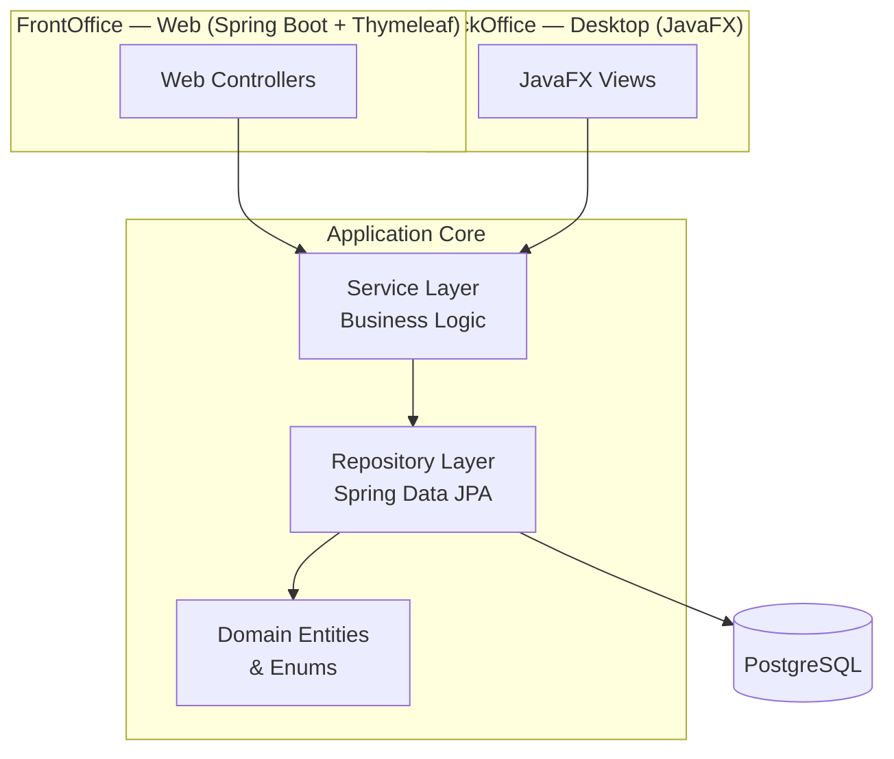
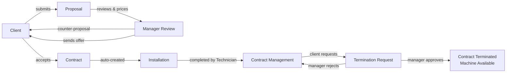
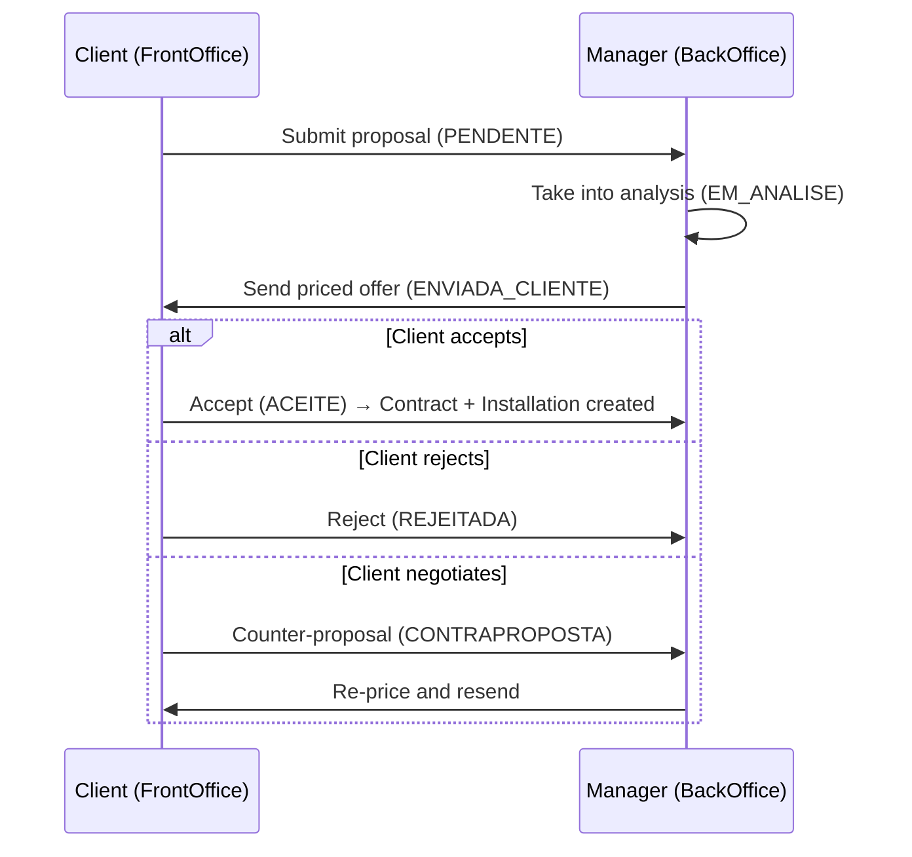

# Vending Rental Management System

> Academic project (**Projeto II**) — a full-stack application that manages the complete lifecycle of vending machine rentals, from the initial commercial proposal through contract management, installation, and termination.

The system is composed of two complementary applications that share the same domain model and PostgreSQL database:

- **BackOffice** — a **JavaFX** desktop application used by internal staff (Administrator, Manager, Receptionist, Technician).
- **FrontOffice** — a **Spring Boot + Thymeleaf** web application used by clients to manage their own proposals, contracts, and installations.

---

## Table of Contents

1. [Overview](#overview)
2. [Features](#features)
3. [Architecture](#architecture)
4. [Role Permissions Matrix](#role-permissions-matrix)
5. [Business Workflow](#business-workflow)
6. [Domain States](#domain-states)
7. [Installation](#installation)
8. [PostgreSQL Setup](#postgresql-setup)
9. [Building with Maven](#building-with-maven)
10. [Running the Web Application (FrontOffice)](#running-the-web-application-frontoffice)
11. [Running the Desktop Application (BackOffice)](#running-the-desktop-application-backoffice)
12. [Example Credentials](#example-credentials)
13. [Project Structure](#project-structure)
14. [Technologies](#technologies)
15. [Future Improvements](#future-improvements)
16. [Authors](#authors)

---

## Overview

The **Vending Rental Management System** digitalises the rental business of a company that leases vending machines to clients such as schools, gyms, and offices.

The application separates concerns between an internal **BackOffice** and a client-facing **FrontOffice**:

- Clients submit rental **proposals** through the web portal and negotiate commercial terms.
- Managers review proposals, define pricing, and send commercial offers back to the client.
- When a proposal is accepted, a **contract** and an **installation** are created automatically.
- Technicians complete or postpone scheduled installations.
- Clients can request the **early termination** of an active contract, which a manager approves or rejects.

The project demonstrates a clean **3-layer architecture** (Controller / Service / Repository), role-based access in the desktop client, and a session-based client portal — all backed by JPA/Hibernate persistence on PostgreSQL.

---

## Features

### BackOffice (JavaFX Desktop)
- Role selection screen with four distinct roles and colour-coded themes.
- Full client management (CRUD) with portal credential assignment.
- Vending machine management.
- Proposal negotiation: analysis, pricing, counter-proposals, and dispatch to client.
- Contract management.
- Installation scheduling and lifecycle management.
- Contract termination request review (approve / reject).
- Read-only screens for restricted roles.

### FrontOffice (Web Portal)
- Client login with session management.
- Personalised dashboard with summary cards and recent activity.
- View and edit personal contact information (email, telephone, address, password).
- Submit new vending machine proposals.
- Select desired contract duration (**1, 2, or 3 years**).
- Accept, reject, or counter-propose commercial offers.
- View contracts and installations.
- Request early contract termination with a justified reason.

---

## Architecture

The application follows the classic **Controller → Service → Repository** layered pattern, with a shared JPA domain model persisted to PostgreSQL.



| Layer | Responsibility |
|-------|----------------|
| **Controller / View** | Handle HTTP requests (web) or UI events (JavaFX). No business rules. |
| **Service** | Enforce business logic, transactions, validation, and state transitions. |
| **Repository** | Spring Data JPA interfaces for data access. |
| **Domain** | JPA entities and enums representing the business model. |

---

## Role Permissions Matrix

| Capability | Administrator | Manager | Receptionist | Technician |
|------------|:-------------:|:-------:|:------------:|:----------:|
| Manage Clients (CRUD) | ✅ | ❌ | ✅ (no delete) | ❌ |
| Create Portal Credentials | ✅ | ❌ | ✅ | ❌ |
| Manage Vending Machines | ✅ | ❌ | ❌ | ❌ |
| Manage Proposals (price / negotiate) | ✅ | ✅ | 👁️ Read-only | ❌ |
| Manage Contracts | ✅ | ✅ | 👁️ Read-only | ❌ |
| Manage Installations | ✅ | ✅ | ❌ | ✅ |
| Complete / Postpone Installations | ✅ | ✅ | ❌ | ✅ |
| Review Termination Requests | ✅ | ✅ | ❌ | ❌ |

**Legend:** ✅ Full access · 👁️ Read-only · ❌ No access

---

## Business Workflow



### Proposal Negotiation Detail



---

## Domain States

### Proposal States
| State | Meaning |
|-------|---------|
| `PENDENTE` | Submitted by client, awaiting manager. |
| `EM_ANALISE` | Under analysis by manager. |
| `ENVIADA_CLIENTE` | Priced offer sent to client. |
| `ACEITE` | Accepted — contract created automatically. |
| `REJEITADA` | Rejected by client. |
| `CONTRAPROPOSTA` | Client returned a counter-proposal. |

### Installation States
| State | Meaning |
|-------|---------|
| `AGENDADA` | Scheduled, pending execution. |
| `CONCLUIDA` | Completed (completion date set automatically). |
| `ADIADA` | Postponed (requires a new date and a delay reason). |

### Termination Request States
| State | Meaning |
|-------|---------|
| `PENDENTE` | Submitted by client, awaiting manager. |
| `APROVADO` | Approved — contract terminated, machine freed. |
| `REJEITADO` | Rejected — contract remains active. |

---

## Installation

### Prerequisites
- **Java 21** (JDK)
- **Maven 3.9+**
- **PostgreSQL 14+**
- A Git client

### Clone the repository
```bash
git clone https://github.com/frocha1012/vending-rental-management-system.git
cd vending-rental-management-system
```

---

## PostgreSQL Setup

1. Ensure PostgreSQL is running locally on port `5432`.
2. Create the database:

```sql
CREATE DATABASE vending_rental;
```

3. The default connection settings (in `src/main/resources/application.properties`) are:

| Property | Value |
|----------|-------|
| URL | `jdbc:postgresql://localhost:5432/vending_rental` |
| Username | `postgres` |
| Password | `pwd` |

Adjust these values to match your local PostgreSQL credentials if needed.

> The schema is created automatically on first run (`spring.jpa.hibernate.ddl-auto=update`), and seed data plus required `CHECK`-constraint migrations are applied at startup.

---

## Building with Maven

Compile and package the project:

```bash
mvn clean install
```

Run only the compilation step:

```bash
mvn compile
```

---

## Running the Web Application (FrontOffice)

Start the Spring Boot web application:

```bash
mvn spring-boot:run
```

Then open your browser at:

```
http://localhost:8080
```

You will be redirected to the client login page.

> 📸 _Screenshot placeholder: client portal dashboard_
>
> ``

---

## Running the Desktop Application (BackOffice)

The JavaFX BackOffice boots its own headless Spring context (sharing the same services and database) and launches the desktop UI:

```bash
mvn javafx:run
```

The main entry point is `pt.ipvc.vending.javafx.DesktopLauncher`.

On launch you are presented with the **role selection screen** (Administrator, Manager, Receptionist, Technician). No password is required for role selection — it determines which menus and screens are available.

> 📸 _Screenshot placeholder: role selection screen_
>
> ``

> 📸 _Screenshot placeholder: installation management (Technician)_
>
> ``

---

## Example Credentials

The application seeds demo data on first startup (only when the database is empty).

### Client Portal (Web FrontOffice)

| Client | Username | Password |
|--------|----------|----------|
| Escola Secundária de Viseu | `escola` | `1234` |
| Ginásio FitViseu | `ginasio` | `1234` |

### BackOffice (JavaFX Desktop)
No login is required — simply select a role on the opening screen:

| Role | Theme |
|------|-------|
| Administrador | Blue |
| Gestor | Green |
| Rececionista | Purple |
| Técnico | Orange |

---

## Project Structure

```
vending-rental-system/
├── pom.xml
├── README.md
└── src/main/
    ├── java/pt/ipvc/vending/
    │   ├── VendingRentalApplication.java      # Spring Boot entry point (web)
    │   │
    │   ├── config/                            # Startup components
    │   │   ├── DataSeeder.java                # Seeds demo data
    │   │   ├── DatabaseMigration.java         # Fixes enum CHECK constraints
    │   │   └── WebConfig.java                 # MVC + interceptor registration
    │   │
    │   ├── domain/
    │   │   ├── entity/                        # JPA entities
    │   │   │   ├── Cliente.java
    │   │   │   ├── VendingMachine.java
    │   │   │   ├── Contrato.java
    │   │   │   ├── Proposta.java
    │   │   │   ├── Instalacao.java
    │   │   │   └── PedidoRescisaoContrato.java
    │   │   └── enums/                         # Domain enums (states, reasons, roles)
    │   │
    │   ├── repository/                        # Spring Data JPA repositories
    │   ├── service/                           # Business logic layer
    │   │   └── exception/                     # Custom exceptions
    │   │
    │   ├── web/
    │   │   ├── controller/                    # Web controllers (portal + admin CRUD)
    │   │   └── interceptor/                   # PortalInterceptor (session auth)
    │   │
    │   └── javafx/                            # BackOffice desktop application
    │       ├── DesktopLauncher.java           # JavaFX + Spring bootstrap
    │       ├── DesktopApplication.java
    │       ├── DesktopMainView.java
    │       ├── RoleSelectionView.java
    │       ├── BackofficeRole.java / RoleTheme.java
    │       └── *DesktopView.java              # Per-module management views
    │
    └── resources/
        ├── application.properties
        └── templates/                         # Thymeleaf templates
            ├── portal/                        # Client FrontOffice pages
            ├── clientes/ · vending-machines/  # Admin CRUD pages
            ├── contratos/ · propostas/ · instalacoes/
            ├── layout.html · portal-layout.html
            └── login.html
```

---

## Technologies

| Category | Technology |
|----------|-----------|
| Language | Java 21 |
| Application Framework | Spring Boot 3 |
| Persistence | Spring Data JPA · Hibernate |
| Database | PostgreSQL |
| Web Templating | Thymeleaf |
| Frontend Styling | Bootstrap 5 |
| Desktop UI | JavaFX |
| Build Tool | Maven |
| Architecture | Controller / Service / Repository (3-layer) |

---

## Future Improvements

- 🔐 **Spring Security** integration for proper BackOffice authentication and password hashing.
- 📊 **Reporting & dashboards** with revenue, occupancy, and contract analytics.
- 📧 **Email notifications** for proposal status changes and installation scheduling.
- 🧾 **PDF generation** for contracts and invoices.
- 🌐 **Internationalisation (i18n)** for multi-language support.
- 🧪 **Automated test suite** (unit + integration) with CI pipeline.
- 📱 **Responsive / mobile-first** redesign of the client portal.
- 🔁 **Audit log** tracking all state transitions for traceability.

---

## Authors

| Name | Role |
|------|------|
| _frocha1012_ | Developer |

> Developed as part of **Projeto II** — Instituto Politécnico de Viana do Castelo (IPVC).

---

_This project is for academic purposes._
